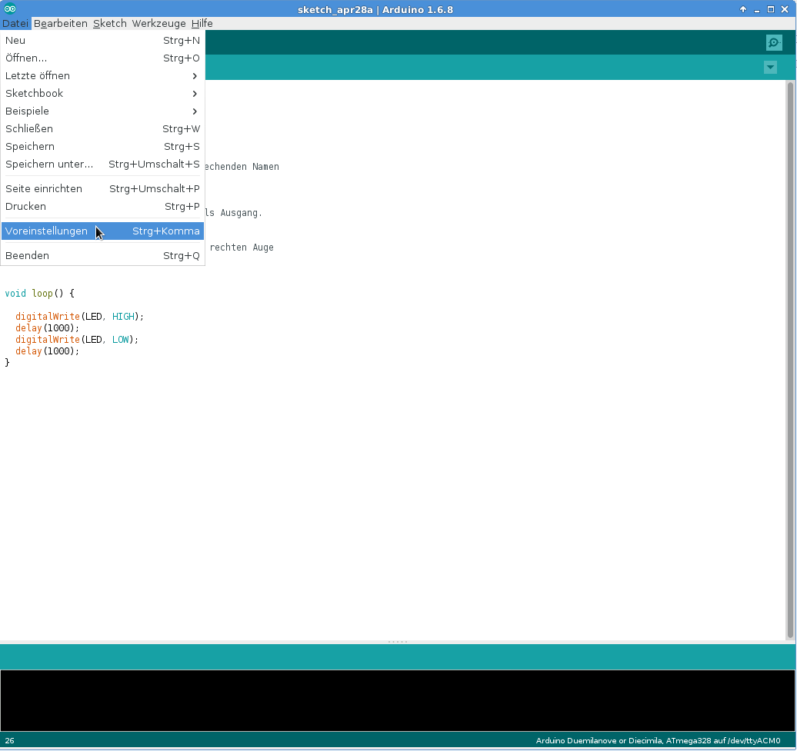
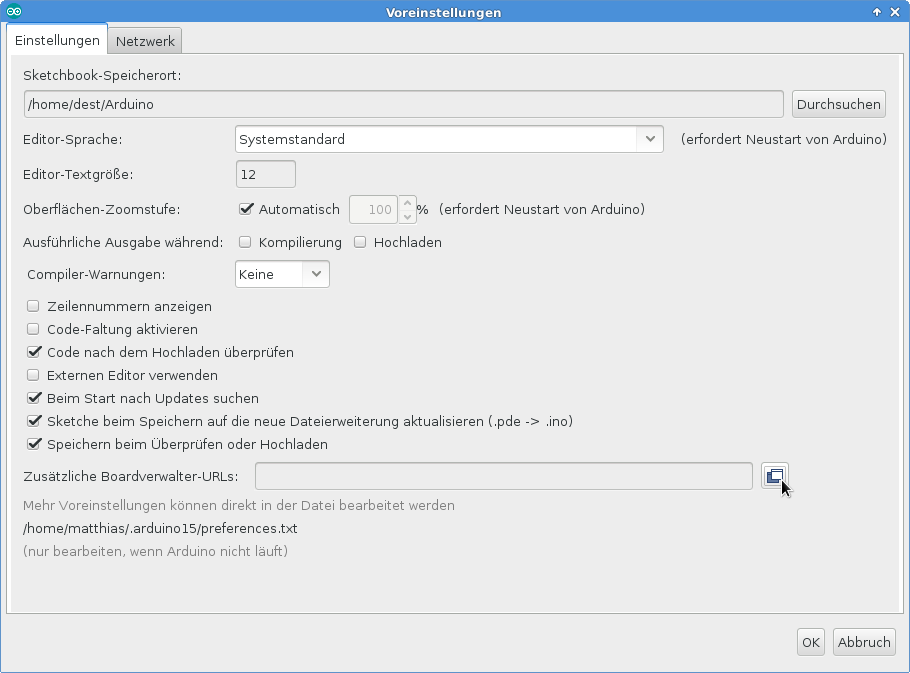
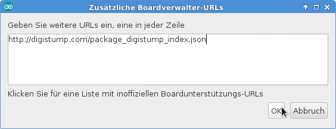
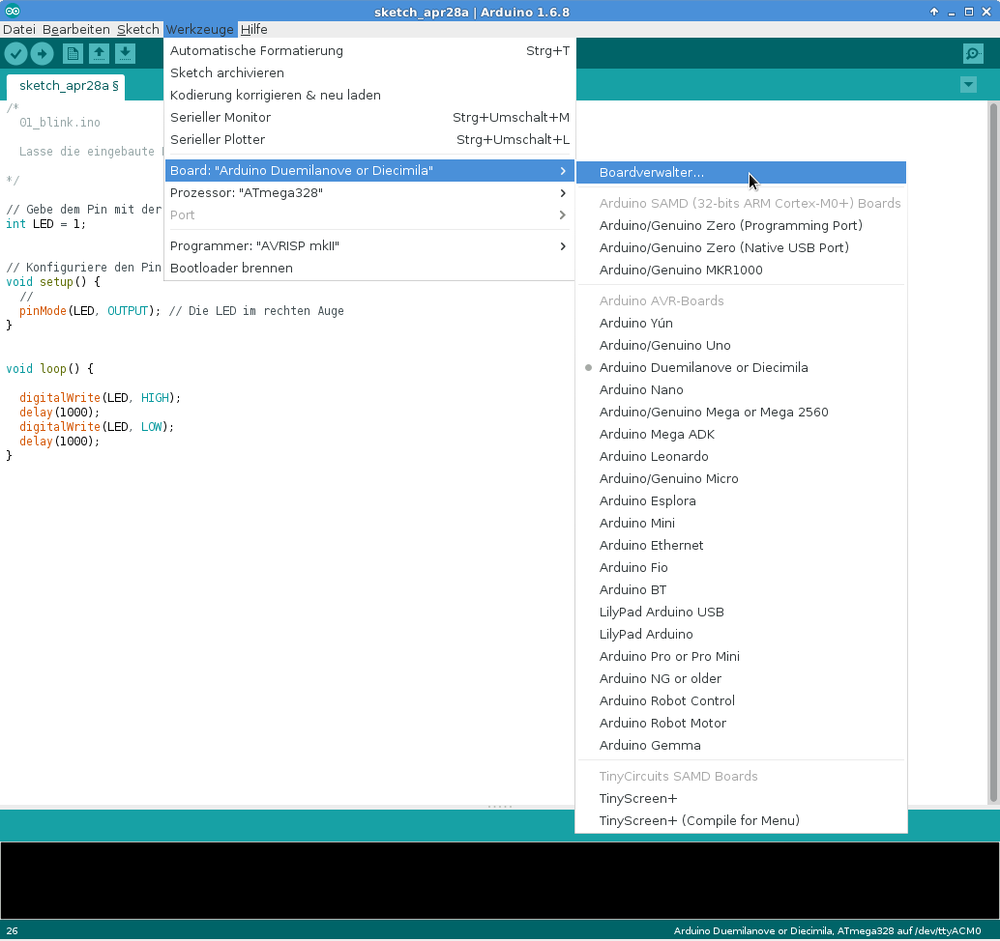
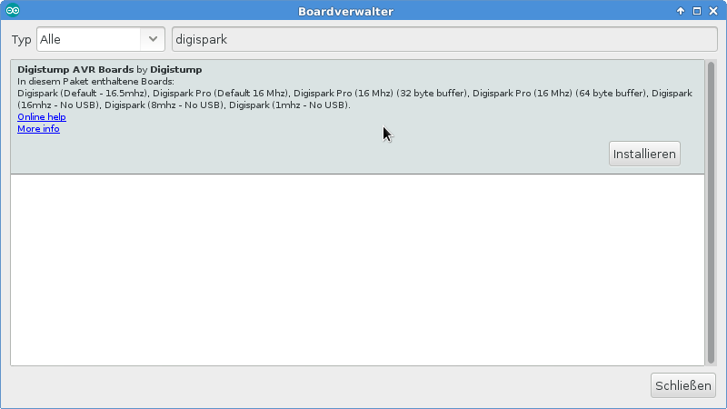
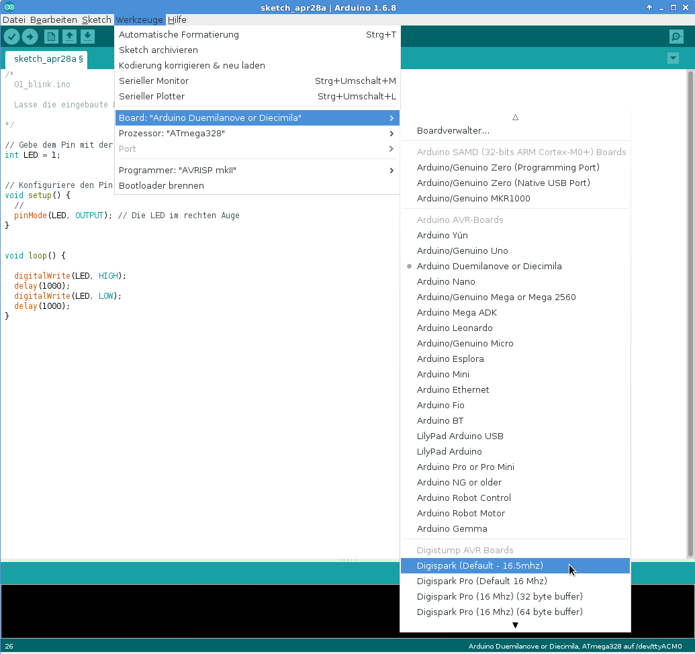
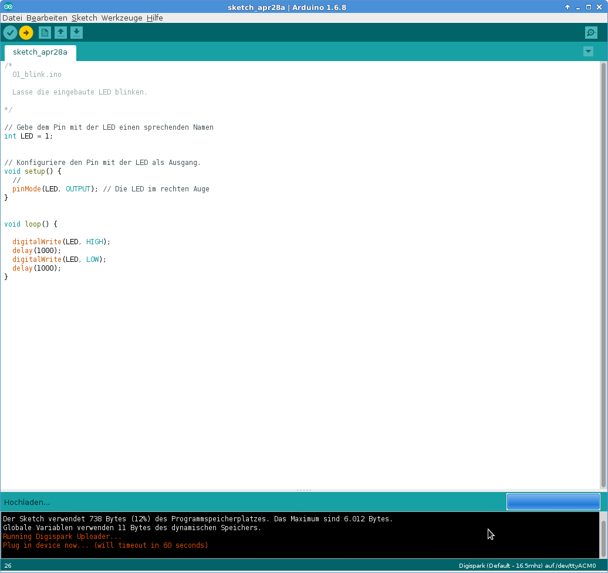

# Einrichten der Arduino Entwicklungsumgebung für den Pinguin
## Der Pinguin
Der Pinguin wird von der bulgarischen Firma Olimex hergestellt und ist ein Arduino auf Basis eines Atmel ATTiny85 Mikrocontrollers.

Die Original Webseite mit allerhand Informationen auf Englisch ist hier:
https://www.olimex.com/Products/Duino/AVR/FOSDEM-85/open-source-hardware

Die folgende Anleitung basiert auf der Original-Anleitung.

## Die Arduino Entwicklungsumgebung

Die Software zum Programmieren des Arduinos heisst auch "Arduino" und lässt sich hier kostenlos herunterladen:

https://www.arduino.cc/en/Main/Software

## Einrichten
Nach dem die Entwicklungsumgebung gestartet ist, muss noch etwas Software nachinstalliert werden.

* Im Menü "Datei" den Dialog "Voreinstellungen" öffnen:
  

* Durch klicken auf das Icon neben dem Eingabefeld "Zusätzliche Boardverwalter-URLs" ein Eingabe-Dialog öffnen:

* In das Eingabefeld die Adresse "http://digistump.com/package_digistump_index.json" eingeben und per "OK" den Dialog schliessen.                                      

* Den Dialog "Voreinstellungen" nun auch mit "OK" schliessen.

* Nun über das Menü "Werkzeuge" den Dialog "Boardverwalter" öffnen.              

* Im Dialog "Boardverwalter" den Text "digispark" eingeben um die passende Software für den Pinguin zu finden und mit einem Klick auf "Installieren" installieren.

* Danach den Dialog "Boardverwalter" schliessen.

* Nun das Board "Digispark (Default - 16.5mhz)" über das Menü "Werkzeuge" auswählen.

* Jetzt ist die Entwicklungsumgebung bereit und das Programm kann übersetzt und in den Arduino übertragen werden.

